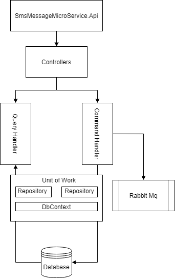
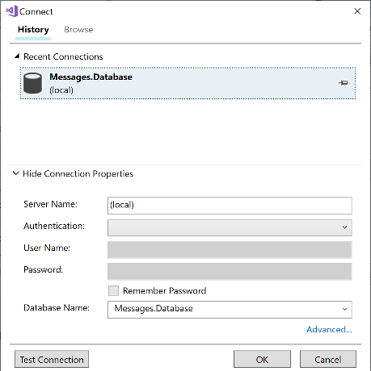
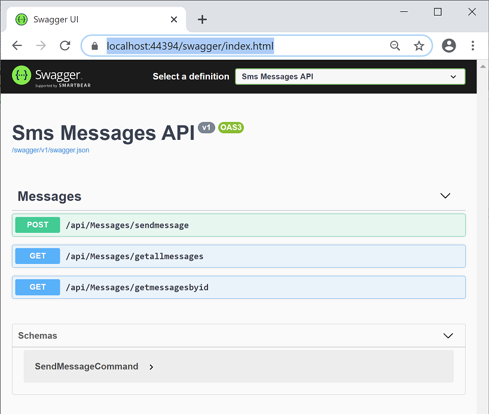

# Microservice with CQRS and mediatR with rabbitMq

A WebApi microservice to simulate the sending of a sms message, upto the point of adding the sms to a message broker, and the retireval of messages from a Sql Server database. Written using .net Core and Visual Studio 2017 with RabbitMq and SqlServer

The Api has three method
- SendMessage 
- GetAllMessages 
- GetMessageById

The architecture of the microservice is CQRS pattern using MediatR, with a repository and unit of work pattern for the database.
XUnit for the test framework.

  

## Minimum Requirements
- .net Core 2.2 
- Visual Studio 2017
- Sql Server
- RabbitMq

## Setup Instructions

The following is required to set and run the microservice.

#### RabbitMq
If you have RabbitMq installed, edit the appsettings.json file in the SmsMessagesMicroService.Api project and add in the correct port and host for your RabbitMq server.

If you do not have RabbitMq installed the easiest way is to run it is in a Docker container. 

[Docker](https://hub.docker.com/_/rabbitmq) already provides a RabbitMq container, this can be setup by running the following two lines in Powershell.

`docker run -d --hostname my-rabbit --name some-rabbit -e RABBITMQ_DEFAULT_USER=user -e RABBITMQ_DEFAULT_PASS=password rabbitmq:3-management`

`docker run -it --rm --name rabbitmq -p 5672:5672 -p 15672:15672 rabbitmq:3-management`

Once installed you can navigate to (http://127.0.0.1:15672/) and access the GUI.

#### Database
The microservice uses a SqlSever database. To install this, open the SmsMessagesMicroService.sln solution file in Visual Studio.
From the Solution Explorer right click on the Messages.Database project and choose Publish. 

You will be asked to configure a connection to your database instance, this will be where you want the database to be installed.

  

#### Application
To run the application, once the database has been installed and rabbitMq is running, from Visual Studio set SmsMessagesMicroService.Api as the start up and click start.

The web api is configured to use Swagger, once running you should be presented with the below screen. From here you can run the api methods.

  

Extended configuration for the database and rabbit is covered in the appsettings.json and launchSettings.json files in the SmsMessagesMicroService.Api project.

## ToDo

- Implement Mesage consumer to process messages on the queue and send to sms provider
- Exception Handling
- Logging
- Unit Test repository

